# AI 公众号自动运营工作流 — 完整架构设计文档

> **版本**: v1.0  
> **日期**: 2026-07-10  
> **技术栈**: n8n + AI LLM + wordscheck + n8n-nodes-wechat-official  

---

## 一、整体架构总览

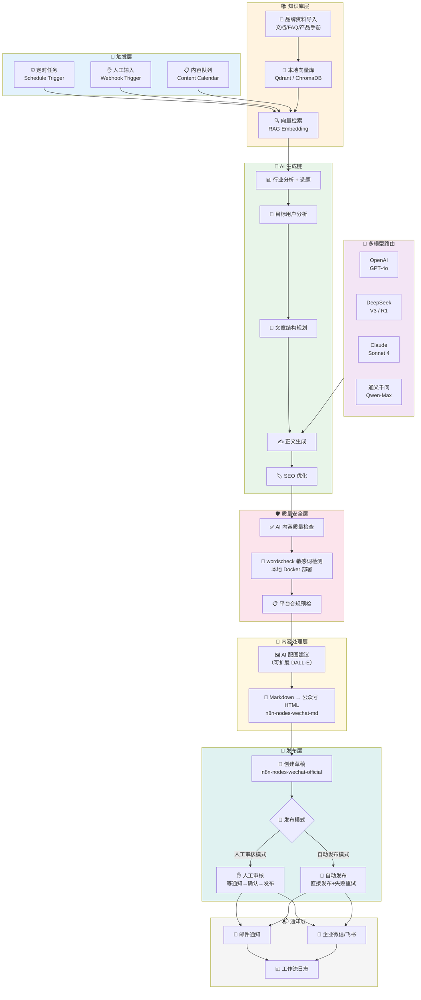

---

## 二、核心工作流详解（按节点顺序）

### 工作流主序列图

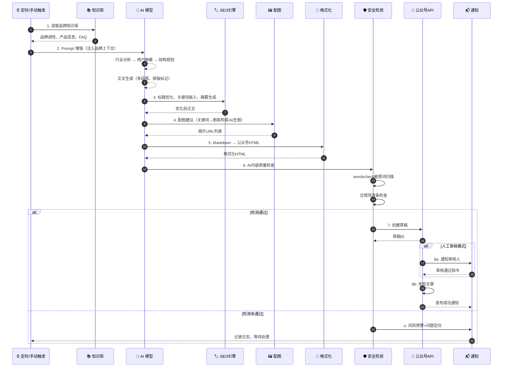

---

## 三、模块详细设计

### 3.1 触发层

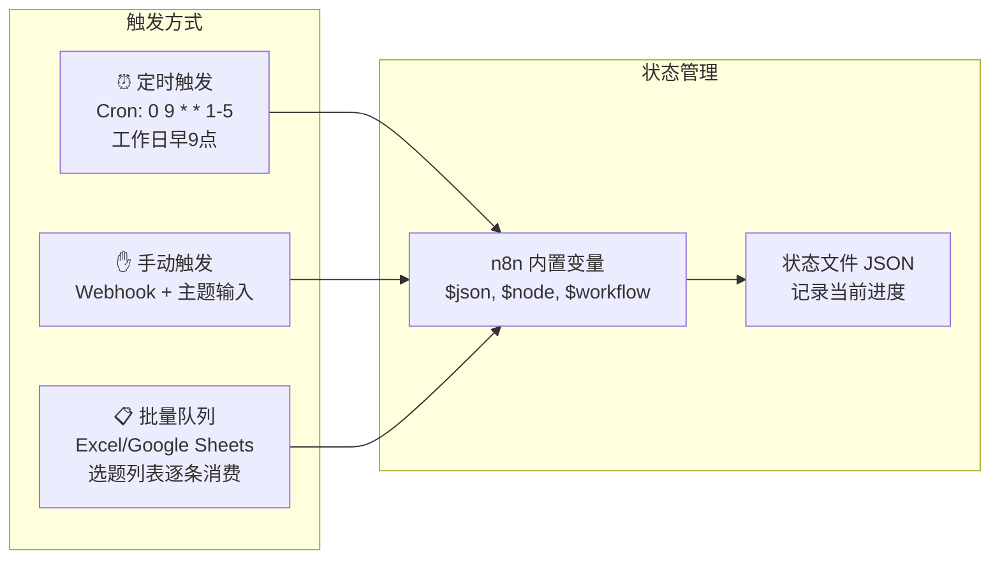

| 触发方式 | 适用场景 | n8n 实现 |
|---------|---------|---------|
| Schedule Trigger | 每日/每周定时生成 | `Schedule Trigger` 节点 + Cron 表达式 |
| Webhook Trigger | 临时加急文章 | `Webhook` 节点接收 POST 请求 |
| Content Queue | 批量选题去重生成 | `Google Sheets` / `Spreadsheet File` 节点逐行读取 |

---

### 3.2 知识库层

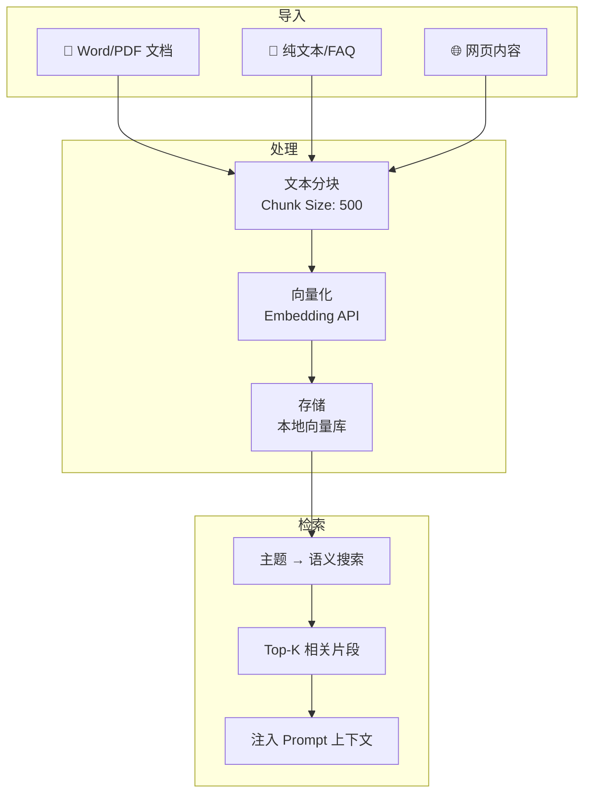

**技术选型**：
- 向量库：`Qdrant`（本地部署）或 `ChromaDB`，都是 Docker 一键启动
- Embedding：用 n8n 的 HTTP Request 调 OpenAI `text-embedding-3-small`
- 检索策略：取 Top-5 片段，拼接后注入 Prompt 的 System Message

---

### 3.3 AI 生成链（多模型路由）

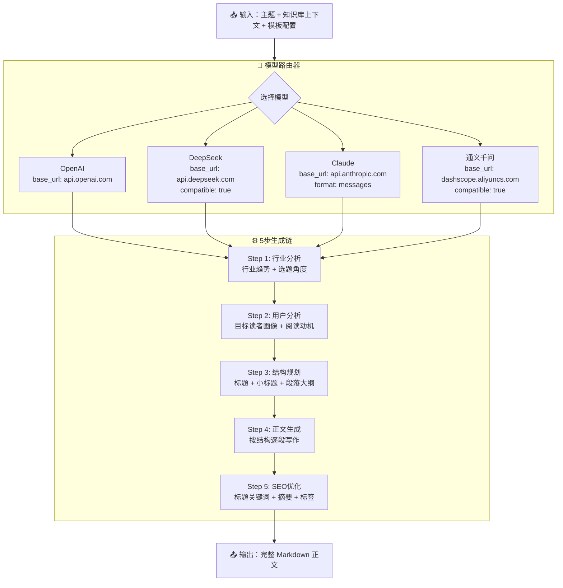

**模型切换配置（n8n 实现）**：

```json
{
  "models": {
    "openai": {
      "base_url": "https://api.openai.com/v1",
      "model": "gpt-4o",
      "temperature": 0.8,
      "max_tokens": 4096
    },
    "deepseek": {
      "base_url": "https://api.deepseek.com/v1",
      "model": "deepseek-chat",
      "temperature": 0.7,
      "max_tokens": 4096
    },
    "claude": {
      "base_url": "https://api.anthropic.com/v1",
      "model": "claude-sonnet-4-20250514",
      "temperature": 0.8,
      "max_tokens": 4096
    },
    "qwen": {
      "base_url": "https://dashscope.aliyuncs.com/compatible-mode/v1",
      "model": "qwen-max",
      "temperature": 0.7,
      "max_tokens": 4096
    }
  }
}
```

> **注**：各模型 Prompt 效果差异客观存在，建议选定 1-2 个主力模型后深度调优，不要频繁切换。

---

### 3.4 内容处理层

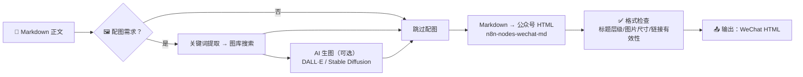

**配图策略**：

| 策略 | 实现方式 | 成本 |
|------|---------|------|
| 关键词图库检索 | Unsplash / Pexels API | 免费 |
| AI 生图 | DALL·E 3 / Stable Diffusion | API 按量计费 |
| 品牌图库 | 本地图库 + 标签匹配 | 免费 |

---

### 3.5 安全检测层

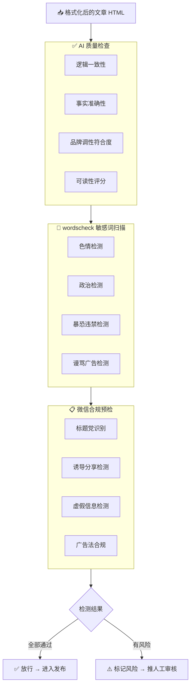

**wordscheck 部署**：
```bash
# Docker 一键部署
docker run -d -p 8080:8080 --name wordscheck wordscheck-image

# n8n 中的 HTTP Request
curl -X POST http://localhost:8080/wordscheck \
  -H "Content-Type: application/json" \
  -d '{"content":"待检测的文章正文"}'

# 返回示例
{
  "code": "0",
  "msg": "检测成功",
  "return_str": "处理后的文本（敏感词已脱敏）",
  "word_list": [
    {"keyword": "艳情", "category": "色情", "position": "4-5", "level": "高"}
  ]
}
```

**判断逻辑**：

| 命中级别 | 处理方式 |
|---------|---------|
| 高 | 🛑 直接驳回，通知原因 |
| 中 | ⚠️ 自动脱敏后推送人工审核 |
| 低 | 📝 自动脱敏，附注风险说明，继续发布 |
| 无 | ✅ 直接放行 |

---

### 3.6 发布层（双模式）

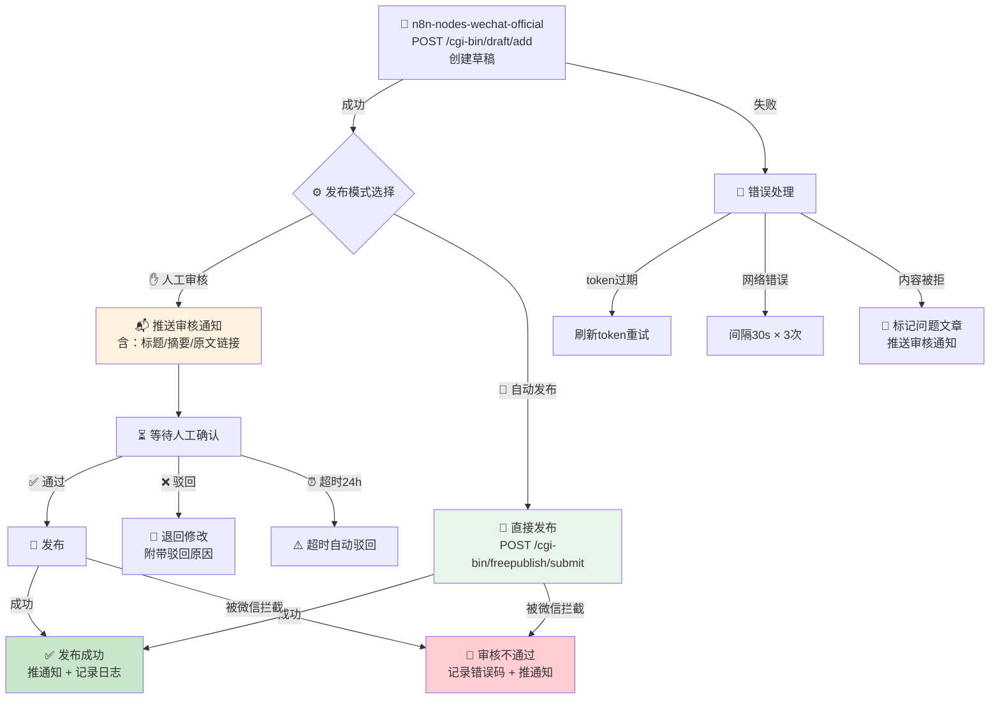

**微信接口调用（通过社区节点）**：
```javascript
// 创建草稿
{
  "resource": "draft",
  "operation": "create",
  "articles": [{
    "title": "{{article.title}}",
    "author": "{{brand.author}}",
    "digest": "{{article.summary}}",
    "content": "{{article.html}}",
    "content_source_url": "{{article.source_url}}",
    "thumb_media_id": "{{article.thumb_media_id}}"
  }]
}

// 发布草稿
{
  "resource": "draft",
  "operation": "publish",
  "mediaId": "{{draft.media_id}}"
}
```

**如果社区节点不可用的备选方案**（原生 HTTP Request）：
```
POST https://api.weixin.qq.com/cgi-bin/draft/add?access_token=TOKEN
POST https://api.weixin.qq.com/cgi-bin/freepublish/submit?access_token=TOKEN
```

---

### 3.7 通知层

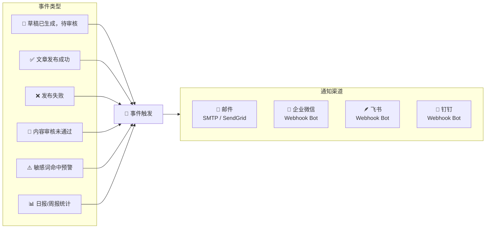

---

## 四、多模板文章生成配置

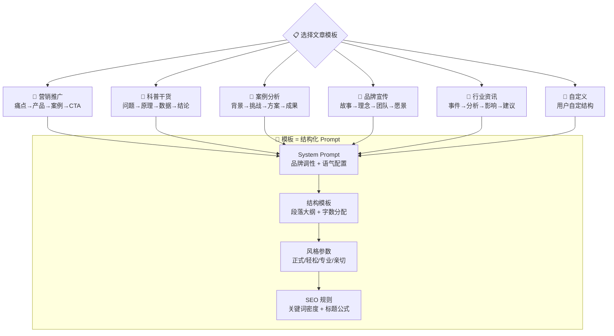

---

## 五、Prompt 配置结构

```yaml
# brand-config.yaml
brand:
  name: "XX科技"
  tone: "专业、亲切、有深度"          # 品牌语气
  author: "XX科技编辑部"
  values:
    - "技术创新"
    - "客户第一"

templates:
  marketing:                           # 营销推广模板
    structure:
      - { type: "hook", label: "开篇钩子", words: 80 }
      - { type: "pain_point", label: "痛点分析", words: 200 }
      - { type: "solution", label: "产品方案", words: 300 }
      - { type: "case", label: "客户案例", words: 200 }
      - { type: "cta", label: "行动号召", words: 100 }
    style: "有冲击力、数据驱动"

  science:                              # 科普干货模板
    structure:
      - { type: "question", label: "提出问题", words: 100 }
      - { type: "principle", label: "原理解析", words: 300 }
      - { type: "data", label: "数据支撑", words: 150 }
      - { type: "conclusion", label: "总结建议", words: 150 }
    style: "严谨、易懂"

  case_study:                           # 案例分析模板
    structure:
      - { type: "background", label: "项目背景", words: 100 }
      - { type: "challenge", label: "核心挑战", words: 150 }
      - { type: "approach", label: "解决方案", words: 300 }
      - { type: "result", label: "项目成果", words: 150 }
    style: "叙事感、有说服力"

seo:
  title_formula: "{数字/疑问词} + {关键词} + {价值许诺}"
  keyword_density: "2%-3%"
  digest_length: 120
  internal_link_rule: "每篇至少1个历史文章链接"

safety:
  forbidden_topics:
    - "医疗承诺"
    - "金融收益保证"
    - "政治敏感话题"
```

---

## 六、错误处理与异常恢复

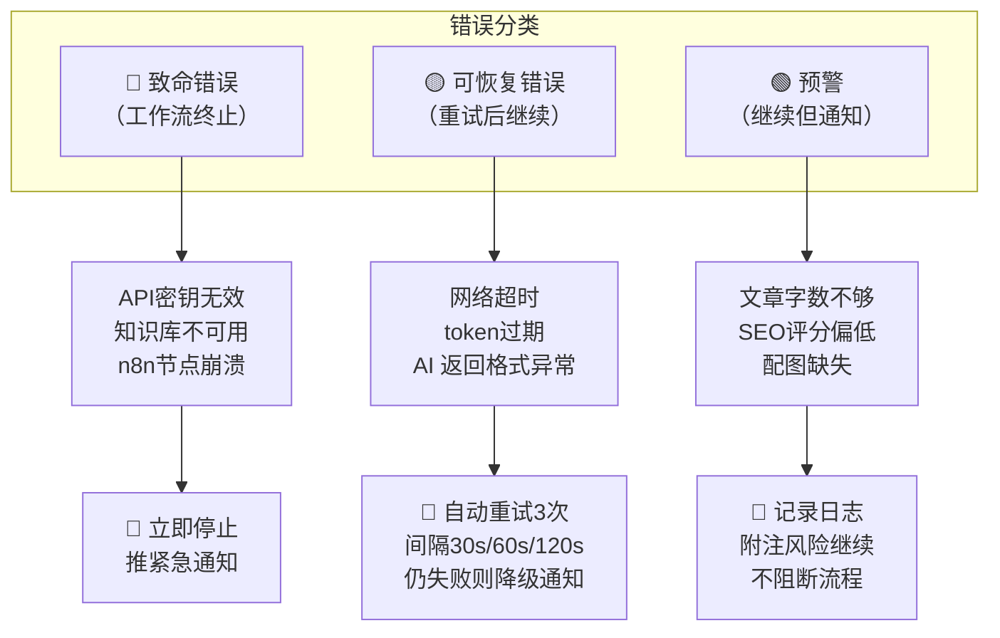

**微信发布错误码对照**：

| 微信错误码 | 含义 | 处理策略 |
|-----------|------|---------|
| 40001 | access_token 无效 | 自动刷新 token 重试 |
| 40007 | 媒体文件格式错误 | 检查图片格式，转 JPG/PNG |
| 40125 | AppSecret 错误 | 致命错误，通知管理员 |
| 45009 | API 调用频率超限 | 等待 5 分钟后重试 |
| 48001 | 无 API 权限 | 确认服务号已认证 |
| 85002 | 审核中，不能重复提交 | 跳过，等待上次结果 |
| 88001 | 内容含有敏感信息 | 标记为"需人工审核" |

---

## 七、部署架构

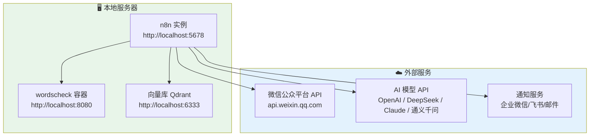

**Docker Compose 一键部署**：
```yaml
version: "3.8"
services:
  n8n:
    image: n8nio/n8n:latest
    ports:
      - "5678:5678"
    volumes:
      - n8n_data:/home/node/.n8n
      - ./n8n-nodes:/home/node/.n8n/custom
    environment:
      - N8N_COMMUNITY_PACKAGES_ENABLED=true
    restart: unless-stopped

  wordscheck:
    build: ./wordscheck
    ports:
      - "8080:8080"
    restart: unless-stopped

  qdrant:
    image: qdrant/qdrant:latest
    ports:
      - "6333:6333"
    volumes:
      - qdrant_data:/qdrant/storage
    restart: unless-stopped

volumes:
  n8n_data:
  qdrant_data:
```

---

## 八、内容模仿功能设计边界

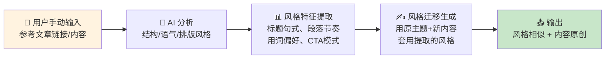

> **设计原则**：
> - **不自动爬取**：所有参考内容由用户手动输入
> - **不原文照搬**：AI 只提取风格特征，内容完全重新生成
> - **不存储原文**：参考内容用完即弃，不落盘

---

## 九、完整数据流（端到端）

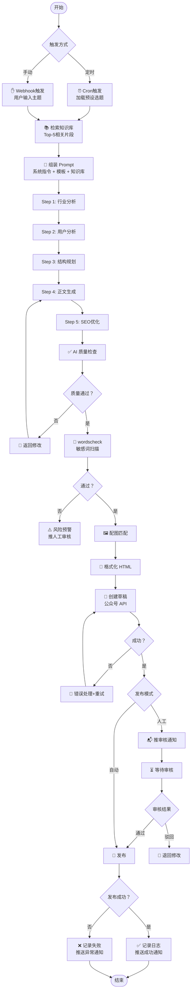

---

## 十、n8n 节点清单与 JSON 结构预览

| 序号 | 节点类型 | 功能 | 关键配置 |
|:---:|---------|------|---------|
| 1 | `Schedule Trigger` | 定时触发 | Cron 表达式 |
| 2 | `Webhook` | 手动输入入口 | POST `/article` |
| 3 | `HTTP Request` | 向量库检索 | Qdrant API |
| 4 | `HTTP Request` | AI 模型调用 (x5) | 多模型路由 |
| 5 | `Function` | Prompt 组装 | JavaScript 代码节点 |
| 6 | `Switch` | 模型选择路由 | 条件分支 |
| 7 | `HTTP Request` | AI 质量检查 | 独立 QA Prompt |
| 8 | `HTTP Request` | wordscheck 检测 | localhost:8080 |
| 9 | `HTTP Request` | 配图 API | Unsplash/Pexels |
| 10 | `n8n-nodes-wechat-md` | Markdown→HTML | 社区节点 |
| 11 | `n8n-nodes-wechat-official` | 创建草稿 | 社区节点 |
| 12 | `n8n-nodes-wechat-official` | 发布文章 | 社区节点 |
| 13 | `Wait` | 等待人工审核 | 超时24h |
| 14 | `Switch` | 发布模式分支 | 自动/人工 |
| 15 | `HTTP Request` | 企业微信通知 | Webhook Bot |
| 16 | `HTTP Request` | 邮件通知 | SMTP |
| 17 | `Error Trigger` | 全局异常捕获 | 兜底处理 |

---

## 十一、下一步实施计划

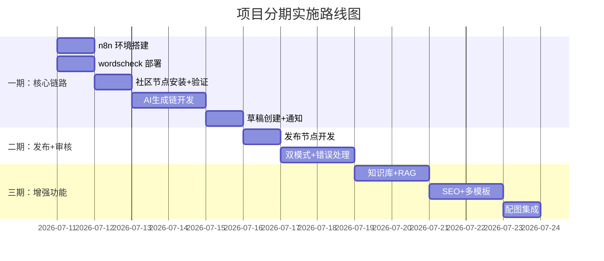

---

> **文档结束** — 下一步：确认架构无异议后，开始生成 n8n 工作流 JSON 文件。
